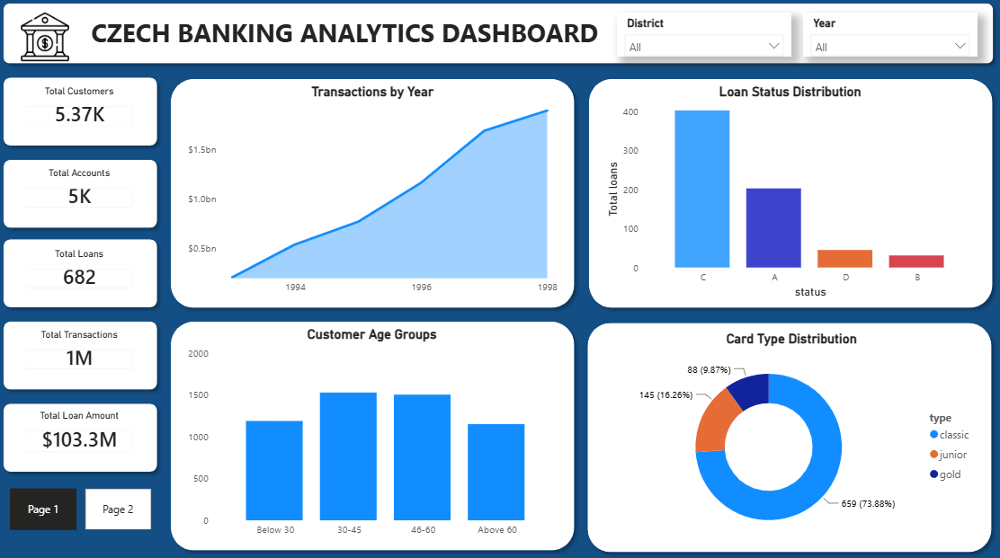
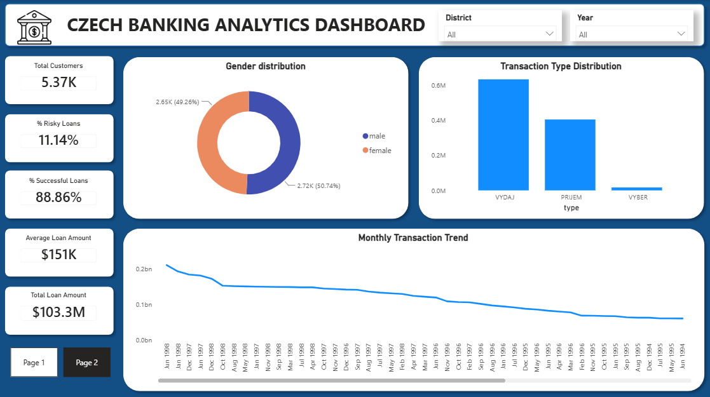

<div align="center">

# 🏦 Czech Banking Analytics Dashboard

### End-to-End Banking Analytics Project using SQL • PostgreSQL • Python • Power BI


</div>

---

# 📌 Project Overview

This project presents an end-to-end **Banking Analytics solution** built using **PostgreSQL, SQL, Python, and Power BI**.

The objective is to transform raw banking data into meaningful business insights through data cleaning, exploratory data analysis, KPI reporting, and interactive dashboards.

The project demonstrates a complete Business Intelligence workflow commonly used by Data Analysts and Business Intelligence Developers.

---

# 🌟 Project Highlights

- 📊 Developed a professional multi-page Power BI Dashboard
- 🗄️ Performed data cleaning and transformation using PostgreSQL
- 📈 Wrote advanced SQL queries for business analysis
- 🐍 Conducted Exploratory Data Analysis (EDA) using Python
- 📉 Designed executive dashboards with KPIs and interactive visualizations
- 💡 Generated actionable business insights for customer, loan, and transaction analysis
- 🚀 Built a portfolio-ready Business Intelligence project

---

# 🎯 Business Problem

Banks generate millions of customer transactions, loans, and account records every year.

Without analytics, answering critical business questions becomes difficult.

This project helps answer questions such as:

- Which districts have the highest customer concentration?
- Which age groups form the majority of customers?
- What is the current health of the loan portfolio?
- How do transaction volumes change over time?
- Which card types are most widely used?
- Which banking KPIs should executives monitor?

---

# 📂 Dataset

**Dataset:** Czech Financial Dataset (Berka Dataset)

The dataset contains multiple banking-related tables including:

- Customers
- Accounts
- Transactions
- Loans
- Cards
- District Information

---

# 🔄 Project Workflow

```
Raw Banking Dataset
        │
        ▼
Data Cleaning (SQL)
        │
        ▼
Exploratory Data Analysis (Python)
        │
        ▼
Data Modeling (Power BI)
        │
        ▼
Dashboard Development
        │
        ▼
Business Insights
```

---

# 🛠️ Tech Stack

| Technology | Purpose |
|------------|----------|
| PostgreSQL | Database Management |
| SQL | Data Cleaning & Analysis |
| Python | Data Analysis & Visualization |
| Pandas | Data Manipulation |
| NumPy | Numerical Analysis |
| Matplotlib | Data Visualization |
| Power BI | Dashboard Development |
| Git | Version Control |
| GitHub | Portfolio Hosting |

---

# 📊 Dashboard Preview

<table>
<tr>
<td width="50%">

### Executive Dashboard - Page 1



</td>

<td width="50%">

### Executive Dashboard - Page 2



</td>
</tr>
</table>

---

# 📈 Executive KPIs

The dashboard provides key banking performance indicators including:

- 👥 Total Customers
- 🏦 Total Accounts
- 💳 Total Cards
- 💰 Total Loans
- 💵 Total Loan Amount
- 📊 Total Transactions

---

# 📉 Dashboard Features

## Customer Analytics

- Customer Age Distribution
- Gender Distribution
- District-wise Customer Analysis

## Loan Analytics

- Loan Status Distribution
- Total Loan Amount
- Loan Performance Analysis

## Transaction Analytics

- Monthly Transaction Trend
- Transaction Type Distribution
- Transaction Volume Analysis

## Card Analytics

- Card Type Distribution
- Customer Card Usage

---

# ❓ Business Questions Answered

- Which districts have the highest customer population?
- Which customer age groups dominate the customer base?
- What is the distribution of loan statuses?
- Which transaction types occur most frequently?
- How do banking transactions vary over time?
- Which card types are preferred by customers?

---

# 💡 Business Insights

## 👥 Customer Insights

- Customer distribution is concentrated across major districts.
- Working-age adults represent the largest customer segment.
- Customer demographics provide opportunities for targeted marketing campaigns.

---

## 💰 Loan Insights

- The majority of loans are in good standing, indicating a healthy loan portfolio.
- A small percentage of loans require monitoring due to repayment status.

---

## 📊 Transaction Insights

- Transaction volume changes over time, indicating seasonal banking activity.
- Monitoring transaction trends helps improve operational planning.

---

## 💳 Card Insights

- One card type dominates customer adoption.
- Premium card usage remains comparatively lower, presenting an opportunity for customer upgrades.

---

## 📈 Business Value

The dashboard enables management to:

- Monitor banking KPIs
- Understand customer behavior
- Evaluate loan performance
- Track transaction trends
- Support data-driven decision-making

---

# 💾 SQL Tasks Performed

- Data Cleaning
- Date Conversion
- Null Value Handling
- Duplicate Detection
- Customer Analysis
- Loan Analysis
- Transaction Analysis
- Card Analysis
- Window Functions
- Aggregate Functions
- Ranking Functions
- Joins
- Group By
- Common Table Expressions (CTEs)

---

# 🐍 Python Analysis

Performed Exploratory Data Analysis (EDA) including:

- Data Cleaning
- Missing Value Analysis
- Distribution Analysis
- Trend Analysis
- Customer Analysis
- Loan Analysis
- Transaction Analysis
- Business Visualizations

### Python Libraries

- Pandas
- NumPy
- Matplotlib

---

# 📊 Power BI Features

- Interactive Dashboard
- KPI Cards
- Dynamic Slicers
- Interactive Filters
- Drill-down Visualizations
- Data Modeling
- DAX Measures
- Executive Reporting

---

# 🚀 Skills Demonstrated

### Database

- PostgreSQL

### SQL

- Window Functions
- CTEs
- Aggregations
- Joins
- Ranking Functions
- Date Functions

### Python

- Pandas
- NumPy
- Matplotlib

### Business Intelligence

- Power BI
- Dashboard Design
- KPI Reporting
- Business Storytelling
- Data Visualization

### Soft Skills

- Analytical Thinking
- Problem Solving
- Business Analysis
- Data Interpretation

---

# 📁 Repository Structure

```
Banking-Analytics
│
├── Dashboard
│   ├── Dashboard-page1.png
│   ├── Dashboard-page2.png
│   └── Czech_Banking_Analytics.pdf
│
├── Dataset
│
├── Python
│
├── SQL
│
└── README.md
```

---

# 📌 Resume Highlights

- Built an end-to-end Banking Analytics solution using SQL, Python, PostgreSQL, and Power BI.
- Developed interactive executive dashboards for customer, loan, transaction, and card analysis.
- Performed extensive data cleaning and transformation using SQL.
- Generated actionable business insights through interactive visualizations and KPI reporting.
- Demonstrated complete Business Intelligence workflow from raw data to executive dashboards.

---

# 🚀 Future Enhancements

- Loan Default Prediction using Machine Learning
- Customer Segmentation using K-Means Clustering
- Customer Lifetime Value Analysis
- Fraud Detection Dashboard
- Automated Dashboard Refresh
- Time Series Forecasting for Banking Transactions

---

# 🎯 Conclusion

This project demonstrates the complete Business Intelligence lifecycle—from raw banking data to interactive executive dashboards.

It showcases practical experience in:

- SQL
- PostgreSQL
- Python
- Power BI
- Data Visualization
- Business Intelligence
- Dashboard Development
- Business Storytelling

The project reflects real-world analytical skills expected from Data Analysts and Business Intelligence professionals.

---

# 👨‍💻 Author

## Arun Kothandaraman

**Master's in Business Analytics**

Passionate about:

- Data Analytics
- Business Intelligence
- SQL
- Python
- Power BI
- Data Visualization

📌 Open to Data Analyst | Business Intelligence Analyst | Analytics Engineer opportunities.

---

<div align="center">

### ⭐ If you found this project useful, consider giving it a star!

</div>
